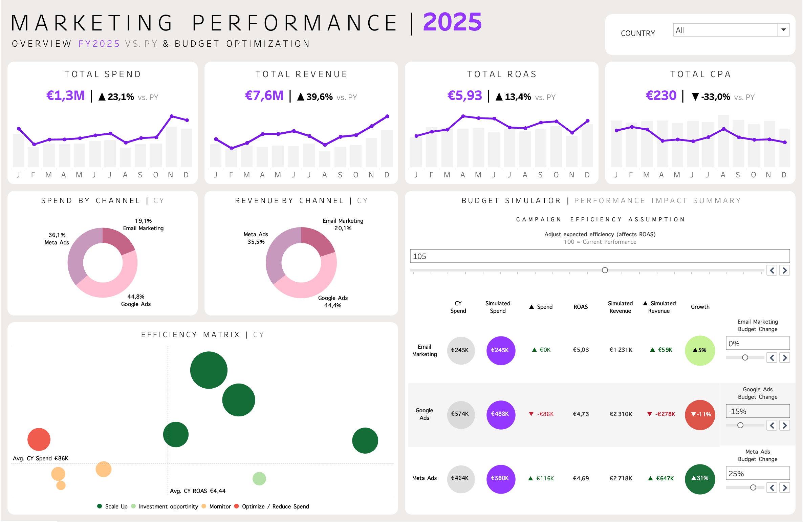

# 03 Marketing Optimization
> <i>Marketing Efficiency & Budget Optimization</i>

This repository contains the **Marketing Optimization** analytical module of the [**NAVA Business Intelligence Portfolio**](https://github.com/ammflo-ops/NAVA-Business-Intelligence-Portfolio/blob/main/README.md).

Powered by a shared [SQL architecture](https://github.com/ammflo-ops/NAVA-00-Technical-Foundation/blob/main/README.md), it evaluates marketing efficiency across acquisition channels while enabling budget optimization through interactive scenario simulation.

---

# 📖 Overview

## Business Objective

Evaluate marketing performance, identify optimization opportunities and support budget allocation decisions across acquisition channels.

## Dashboard Overview

The dashboard combines marketing KPIs, channel performance analysis and interactive budget simulation to support investment decisions.

<p align="center">
  
</p>

Explore the interactive dashboard on Tableau Public : [**View Dashboard**](https://public.tableau.com/app/profile/florence.ammany/viz/Portfolio_Project_III_MarketingPerformance/MARKETINGDB)

### Key Performance Indicators

- Marketing Spend
- Net Sales
- ROAS
- CPA

### Analytical Focus

- Channel Performance
- Marketing Efficiency
- Budget Allocation
- Budget Simulation
- Scenario Analysis

---

# 📖 Marketing Efficiency & Budget Optimization

## Summary of Insights

- **Google Ads** generated the largest share of both spend and revenue.
- **Meta Ads** showed the strongest growth opportunity within the simulation.
- **Email Marketing** remained the most cost-efficient acquisition channel.
- Budget optimization scenarios highlighted opportunities to improve overall ROAS without increasing total investment.

## Recommendations & Next Steps

- Increase investment in **Meta Ads** while maintaining current efficiency assumptions.
- Preserve **Email Marketing** as a high-performing, low-cost acquisition channel.
- Reassess budget allocation for **Google Ads** to maximize return on investment.
- Use scenario simulation to support future budget planning decisions.

---

# 📂 Repository Structure

```text
03_Marketing_Optimization
│
├── dashboard/
│   ├── marketing_optimization.twbx      # Tableau workbook
│   └── marketing_dashboard.png          # Dashboard preview
│
├── sql/
│   └── vw_marketing_performance.sql     # Business-ready analytical view
│
└── README.md                            # Project overview
```

---

# 💡 About this Project

This repository contains the **Marketing Optimization** analytical module of the [**NAVA Business Intelligence Portfolio**](https://github.com/ammflo-ops/NAVA-Business-Intelligence-Portfolio/blob/main/README.md).

It demonstrates how business-ready SQL views can be transformed into interactive dashboards that evaluate marketing efficiency and support budget optimization through scenario-based decision-making.

The dashboard is powered by the shared SQL architecture available in the [**00 Technical Foundation**](https://github.com/ammflo-ops/NAVA-00-Technical-Foundation/blob/main/README.md) repository.
